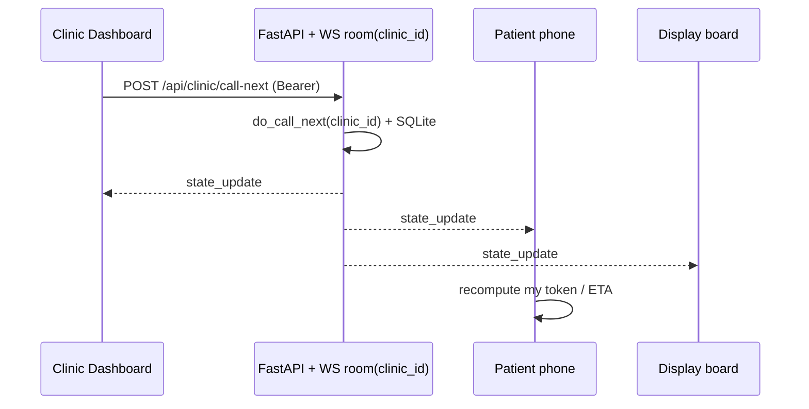

# Socket Event Diagram — MediQueue (Queue Cure '26)

Multi-tenant: every clinic has its own queue and its own WebSocket "room".
Clients subscribe to one clinic via `ws://<host>/ws?clinic_id=<id>`. Any mutation
to that clinic rebroadcasts a full snapshot to everyone in that room only.

## Accounts

- **Clinic** account → owns a queue, runs the dashboard, calls the next token.
- **Patient** account → joins a clinic's queue, gets a token, watches it live.

Auth is an HMAC-signed token (stdlib) returned on signup/login and sent as
`Authorization: Bearer <token>`. Passwords are PBKDF2-HMAC-SHA256 hashed.

## Connection topology (one room per clinic)

```
   Clinic Dashboard            Patient phone(s)            Display board (TV)
   /clinic (clinic auth)       /patient (patient auth)     /display/:clinicId
        │                            │                            │
        │   ws://host/ws?clinic_id=42 (all subscribe to the SAME room)
        └─────────────┬──────────────┴──────────────┬─────────────┘
                      ▼                              ▼
        ┌──────────────────────────────────────────────────────────┐
        │   FastAPI — ConnectionManager.rooms[clinic_id] = [ws...]   │
        │   SQLite: accounts(clinic|patient) + tokens(per clinic)    │
        └──────────────────────────────────────────────────────────┘
```

## Event flow — a clinic clicks "Call Next"

```
CLINIC DASHBOARD          FASTAPI (REST + WS room 42)        PATIENT / DISPLAY
──────────────            ──────────────────────────         ─────────────────
 click "Call Next"
      │ POST /api/clinic/call-next  (Bearer clinic token)
      ├───────────────────────►
      │                  do_call_next(42)
      │                  serving→done, next waiting→serving
      │                  broadcast_clinic(42)
      │                       │
      │   ◄───────────────────┤ send_json(snapshot)  → every ws in room 42
      │   {type:state_update} ├───────────────────────────────────────────►
   re-render queue                              patient recomputes own token,
                                                tokens-ahead, ETA from snapshot
```

## Events

| Direction       | Channel | Endpoint / event                  | Auth     |
|-----------------|---------|-----------------------------------|----------|
| Client → Server | REST    | `POST /api/auth/signup`           | public   |
| Client → Server | REST    | `POST /api/auth/login`            | public   |
| Client → Server | REST    | `POST /api/clinic/patients`       | clinic   |
| Client → Server | REST    | `POST /api/clinic/call-next`      | clinic   |
| Client → Server | REST    | `PUT  /api/clinic/avg-time`       | clinic   |
| Client → Server | REST    | `POST /api/clinic/reset`          | clinic   |
| Client → Server | REST    | `GET  /api/clinics`               | any auth |
| Client → Server | REST    | `POST /api/clinics/{id}/join`     | patient  |
| Client → Server | REST    | `POST /api/clinics/{id}/leave`    | patient  |
| Client → Server | REST    | `GET  /api/clinics/{id}/me`       | patient  |
| Server → Client | WS      | `state_update` (per clinic room)  | open     |
| Client ↔ Server | WS      | connect `?clinic_id=` / keep-alive| open     |

## `state_update` snapshot payload

```json
{
  "type": "state_update",
  "clinic_id": 42,
  "clinic_name": "Sunrise Clinic",
  "current_token": 3,
  "serving": { "token": 3, "name": "Riya Sharma", "patient_id": 7 },
  "waiting": [
    { "token": 4, "name": "Amit", "patient_id": null, "position": 1, "estimated_wait": 10 },
    { "token": 5, "name": "Neha", "patient_id": 9,    "position": 2, "estimated_wait": 20 }
  ],
  "tokens_ahead": 2,
  "avg_consultation_time": 10,
  "stats": { "waiting": 2, "served": 2, "total": 5 },
  "timestamp": "2026-06-24T10:00:00Z"
}
```

## Why this design

- **One room per clinic.** `clinic_id` namespaces both the SQLite rows and the
  WebSocket subscribers, so clinics never see each other's queues.
- **REST mutates, WebSocket notifies.** Every action mutates SQLite then calls
  `broadcast_clinic(clinic_id)` — one snapshot to every screen in that room.
- **Patients are self-locating.** The snapshot carries `patient_id` on each
  token; a patient's phone finds its own row to show token, tokens-ahead, and ETA
  — no per-patient socket needed.
- **Auth-gated writes, open reads.** Only the owning clinic can call next; the
  read-only display/patient view subscribes to the public snapshot stream.


