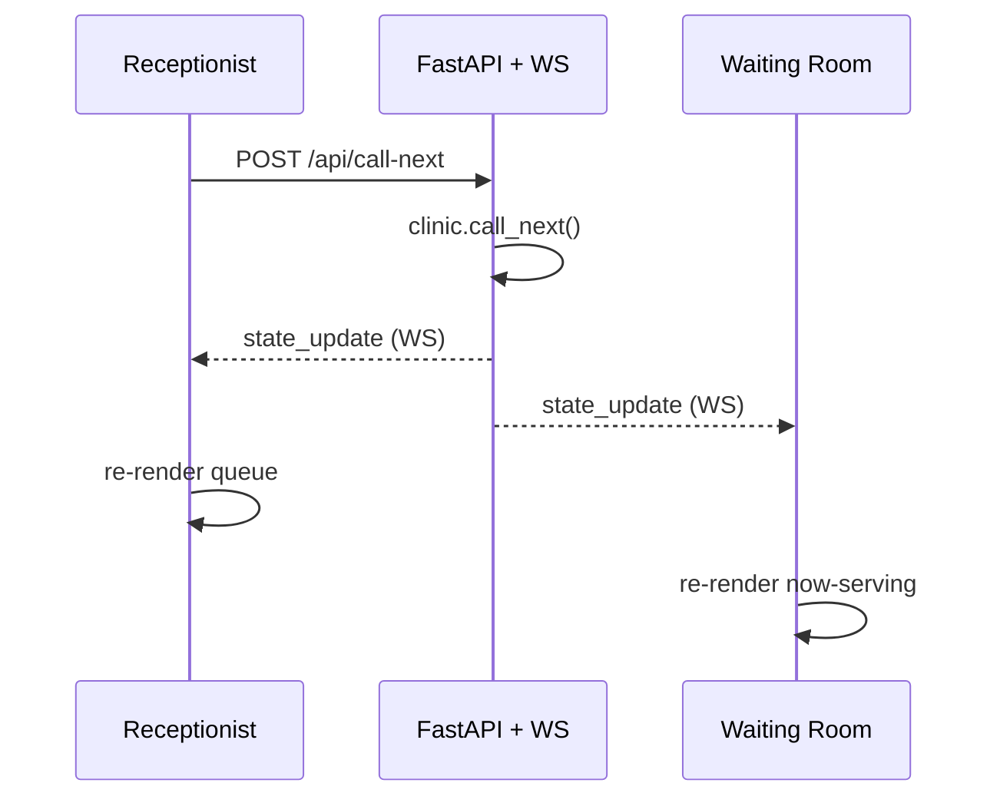

# Socket Event Diagram — MediQueue (Queue Cure '26)

## Connection topology

```
        ┌──────────────────────┐                ┌──────────────────────┐
        │  Receptionist (React)│                │  Waiting Room (React)│
        │   /reception         │                │   /waiting           │
        └──────────┬───────────┘                └───────────┬──────────┘
                   │  ws://localhost:8000/ws                 │
                   │  (persistent WebSocket)                 │
                   ▼                                         ▼
        ┌─────────────────────────────────────────────────────────────┐
        │                  FastAPI  —  ConnectionManager                │
        │     in-memory Clinic state  +  list[WebSocket] connections    │
        └─────────────────────────────────────────────────────────────┘
```

## Event flow — "Call Next" is the key moment

```
RECEPTIONIST            FASTAPI (REST + WS)                 WAITING ROOM
─────────────           ───────────────────                ────────────
                                                                
 click "Call Next"                                              
      │                                                         
      │  POST /api/call-next                                    
      ├───────────────────────►                                
      │                   clinic.call_next()                    
      │                   (serving → done,                      
      │                    next waiting → serving)              
      │                        │                                
      │                   broadcast_state()                     
      │                        │                                
      │   ◄────────────────────┤  send_json(snapshot)           
      │   {type:"state_update"}│                                
      │                        ├──────────────────────────────► 
      │                        │   {type:"state_update"}        
      │  HTTP 200 (also state) │                                
      ◄────────────────────────┤                                
      │                        │                                
   re-render                              re-render now-serving 
   queue + stats                          token, tokens ahead,  
                                          estimated wait        
```

## Events

| Direction          | Channel | Event / Endpoint        | Payload                          |
|--------------------|---------|-------------------------|----------------------------------|
| Client → Server    | REST    | `POST /api/patients`    | `{ name }`                       |
| Client → Server    | REST    | `POST /api/call-next`   | —                                |
| Client → Server    | REST    | `PUT  /api/avg-time`    | `{ minutes }`                    |
| Client → Server    | REST    | `POST /api/reset`       | —                                |
| Server → Client    | WS      | `state_update`          | full clinic snapshot (see below) |
| Client ↔ Server    | WS      | connect / keep-alive    | snapshot pushed on connect       |

## `state_update` snapshot payload

```json
{
  "type": "state_update",
  "current_token": 3,
  "serving": { "token": 3, "name": "Riya Sharma", "status": "serving" },
  "waiting": [
    { "token": 4, "name": "Amit", "position": 1, "estimated_wait": 10 },
    { "token": 5, "name": "Neha", "position": 2, "estimated_wait": 20 }
  ],
  "tokens_ahead": 2,
  "avg_consultation_time": 10,
  "stats": { "waiting": 2, "served": 2, "total": 4 },
  "timestamp": "2026-06-24T10:00:00Z"
}
```

## Why this design

- **REST mutates, WebSocket notifies.** Any action (add / call-next / avg-time)
  hits a REST endpoint, mutates the single in-memory `Clinic`, then calls
  `broadcast_state()` which pushes one `state_update` to every open socket.
- **One snapshot, many screens.** The server never sends partial diffs — it
  sends the whole state. Both screens render off the same shape, so they can
  never drift out of sync.
- **Auto-reconnect.** The client retries the socket every 1.5s if it drops, and
  the server replays the current snapshot on every new connection.

